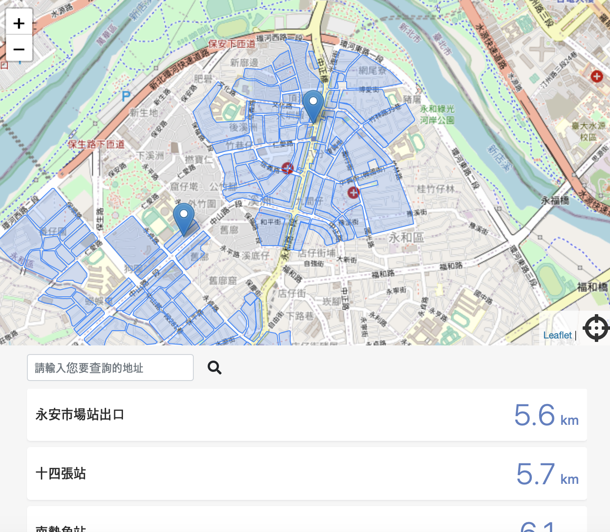

# urban
https://oakmega-356009.web.app

## Project setup
```
npm install
```

### Compiles and hot-reloads for development
```
npm run serve
```

### Compiles and minifies for production
```
npm run build
```

### Lints and fixes files
```
npm run lint
```

### Customize configuration
See [Configuration Reference](https://cli.vuejs.org/config/).

---
## 目標：

用 Vue 做一個新北市都市更新地點的查詢網頁（如 demo），用戶查詢前必須先登入 Google 並且綁定 Facebook

使用的 API：

1. 都更地點 API （附件一）
2. 都更地點 Polygon API（附件二）

API Url：https://asia-east2-botfat.cloudfunctions.net/project_controller

※ 預防未來請求不到，已改為讀取 local json




條件：

1. Google Login 與 Facebook Login 要用 「原生寫法」, 不要 firebase, 不要套件
2. 地圖呈現用 leaflet.js
3. 顯示 User Location Pin 的 tooltip 要顯示 facebook 與 google 大頭貼
4. 都更地點 API 回傳資料用 list 方式呈現到頁面也同步呈現到地圖上
5. 都更地點 Polygon API 回傳資料呈現到地圖上